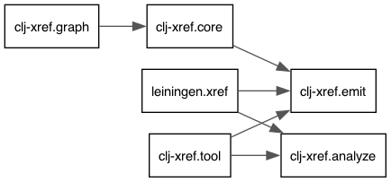
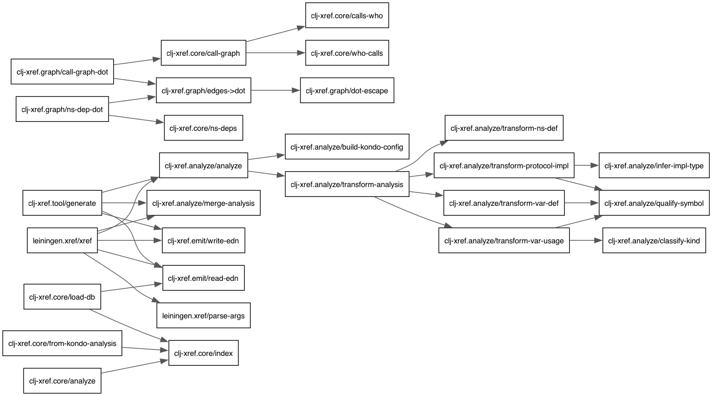

# clj-xref

A cross-reference database for Clojure code, built on [clj-kondo](https://github.com/clj-kondo/clj-kondo) static analysis ([sponsor Borkdude!](https://github.com/sponsors/borkdude)). Analyze your project once, then ask questions like "who calls this function?", "what does this function depend on?", and "where is this protocol implemented?"

## What is it?

clj-xref builds a searchable cross-reference database from your Clojure source code. It works in two phases:

1. **Generate** — Analyze your source files and write an EDN database to disk (via a Leiningen plugin or deps.edn tool)
2. **Query** — Load the database and ask questions about your code from the REPL, scripts, or other tools

Think of it as [ctags](https://ctags.io/) or [cscope](http://cscope.sourceforge.net/) for Clojure, but with semantic understanding of vars, namespaces, protocols, and multimethods. The API is inspired by [SBCL's `sb-introspect`](http://www.sbcl.org/manual/#sb_002dintrospect) (`who-calls`, `who-references`, `who-macroexpands`) and [Smalltalk's senders/implementors](https://wiki.c2.com/?FinderTool) queries.

### Why you might want it

**Feeding context to LLMs.** Instead of guessing or having it search your entire `src/` tree, it can query the xref database for the dependency neighborhood of the function you're working on — just the relevant code, in far fewer tokens.

**Understanding unfamiliar code.** You inherit a large Clojure codebase. You need to know what calls `process-payment` before you change its signature. `who-calls` gives you the answer instantly, across every namespace.

**Dead code detection.** Find vars that are defined but never referenced from anywhere. Stop carrying code that nothing uses.

**Codebase visualization.** Export the call graph or namespace dependency graph for documentation, onboarding, or architecture reviews.

**CI and automation.** Run `lein xref` or `clj -T:xref generate` in CI to produce a cross-reference artifact. Use it downstream for impact analysis, change-risk estimation, or custom linting rules.

**REPL-driven exploration.** Load the database in your REPL and explore interactively. Since queries return plain Clojure maps and vectors, you can compose them freely with `filter`, `map`, `group-by`, or anything else.

### What it is not

- **Not an IDE or editor plugin.** clj-xref is a library. It produces data. Editor integration can be built on top of it (and the API is designed for that), but clj-xref itself has no UI.
- **Not a replacement for clojure-lsp.** If you want real-time find-references in your editor, use [clojure-lsp](https://clojure-lsp.io/). clj-xref is for programmatic, batch, and REPL use cases.
- **Not a type checker or linter.** Use [clj-kondo](https://github.com/clj-kondo/clj-kondo) for that. (clj-xref uses clj-kondo internally for analysis.)

## Installation

### Leiningen

Add clj-xref to your `:plugins` vector in `project.clj`:

```clojure
:plugins [[com.github.danlentz/clj-xref "0.1.0"]]
```

To also use the query API from your REPL, add it to `:dependencies`:

```clojure
:dependencies [[com.github.danlentz/clj-xref "0.1.0"]]
```

### deps.edn

Add a tool alias to your `deps.edn`:

```clojure
{:aliases
 {:xref {:extra-deps {com.github.danlentz/clj-xref {:mvn/version "0.1.0"}}
         :ns-default clj-xref.tool}}}
```

To use the query API in your project, add clj-xref as a dependency:

```clojure
{:deps {com.github.danlentz/clj-xref {:mvn/version "0.1.0"}}}
```

## Usage

### Command-line interface

The fastest way to use clj-xref. Add the `:xref` alias to your `deps.edn` (project or `~/.clojure/deps.edn`):

```clojure
:xref {:extra-deps {com.github.danlentz/clj-xref {:mvn/version "0.1.0"}}
       :main-opts ["-m" "clj-xref.cli"]}
```

Then:

```bash
clj -M:xref init                          # generate the database
clj -M:xref who-calls myapp.orders/process-payment
clj -M:xref calls-who myapp.web/handler
clj -M:xref who-implements myapp.protocols/Billable
clj -M:xref unused                        # find dead code
clj -M:xref ns-deps myapp.orders
clj -M:xref ns-dependents myapp.orders
clj -M:xref apropos process
clj -M:xref graph myapp.core/main
```

The database is auto-generated on first query if `.clj-xref/xref.edn` doesn't exist.

### Generating the database

You can also generate the database explicitly:

```bash
# Leiningen
lein xref

# deps.edn tool
clj -T:xref generate
clj -T:xref generate :paths '["src"]' :output '"target/xref.edn"'
```

Incremental mode re-analyzes specific files and merges into the existing database:

```bash
lein xref :only src/myapp/orders.clj
clj -T:xref generate :only '["src/myapp/orders.clj"]'
```

Note: incremental mode only re-analyzes the specified files. If you change an exported definition (e.g., rename a function or change it to a macro), callers in other files retain stale metadata until a full rebuild.

### Querying from the REPL

```clojure
(require '[clj-xref.core :as xref])

;; Load the generated database
(def db (xref/load-db))

;; Who calls this function?
(xref/who-calls db 'myapp.orders/process-payment)
;; => [{:kind :call, :from myapp.web/checkout-handler,
;;      :to myapp.orders/process-payment,
;;      :file "src/myapp/web.clj", :line 47, :col 5, :arity 2}
;;     {:kind :call, :from myapp.batch/retry-failed,
;;      :to myapp.orders/process-payment,
;;      :file "src/myapp/batch.clj", :line 23, :col 7, :arity 2}]

;; What does this function call?
(xref/calls-who db 'myapp.web/checkout-handler)

;; Who implements this protocol?
(xref/who-implements db 'myapp.protocols/Billable)

;; What dispatch values exist for this multimethod?
(xref/who-dispatches db 'myapp.events/handle-event)

;; Which namespaces depend on this one?
(xref/ns-dependents db 'myapp.orders)

;; Find dead code
(xref/unused-vars db)

;; Transitive call graph (depth 3, outgoing)
(xref/call-graph db 'myapp.orders/process-payment {:depth 3 :direction :outgoing})
;; => #{[myapp.orders/process-payment myapp.db/transact]
;;      [myapp.db/transact myapp.db/get-conn] ...}

;; Search for vars by name
(xref/apropos db #"process")
```

Since results are plain maps and vectors, compose with standard Clojure:

```clojure
;; All external callers of process-payment (excluding same-namespace calls)
(->> (xref/who-calls db 'myapp.orders/process-payment)
     (remove #(= "myapp.orders" (namespace (:from %)))))

;; Vars in myapp.util that nothing in the project references
(xref/unused-vars db)
```

### Querying without generating a file

If you don't need the EDN file, you can analyze and query in-memory directly:

```clojure
(def db (xref/analyze ["src" "test"]))
(xref/who-calls db 'myapp.orders/process-payment)
```

This requires clj-kondo on the classpath.

### Claude Code integration

An example `/xref` slash command for Claude Code is included in [`doc/claude-slash-command.md`](doc/claude-slash-command.md). Copy it to `.claude/commands/xref.md` in your project to add `/xref who-calls`, `/xref unused`, etc. as Claude Code commands.

## Query API Reference

All query functions take a database (from `load-db` or `analyze`) and return vectors of maps.

| Function | Returns |
|---|---|
| `(who-calls db sym)` | Call sites of `sym` |
| `(calls-who db sym)` | Vars called by `sym` |
| `(who-references db sym)` | All references to `sym` (calls, reads, macroexpansions) |
| `(who-macroexpands db sym)` | Sites where the macro `sym` is expanded |
| `(who-implements db sym)` | Implementations of the protocol `sym` |
| `(who-dispatches db sym)` | `defmethod` dispatch values for the multimethod `sym` |
| `(ns-vars db ns-sym)` | All var definitions in a namespace |
| `(ns-deps db ns-sym)` | Namespaces that `ns-sym` depends on |
| `(ns-dependents db ns-sym)` | Namespaces that depend on `ns-sym` |
| `(unused-vars db)` | Vars defined but never referenced |
| `(call-graph db sym opts)` | Transitive call graph as `#{[from to] ...}` edges |
| `(apropos db pattern)` | Vars matching a name pattern (string or regex) |

### Xref entry shape

Each entry in a query result is a map:

```clojure
{:kind     :call          ; :call, :reference, :macroexpand, :dispatch, :implement
 :from     'myapp.web/handler  ; the var containing this reference
 :to       'myapp.db/query     ; the var being referenced
 :file     "src/myapp/web.clj"
 :line     42
 :col      5
 :arity    2}             ; for :call kind — which arity was used
```

### Graphviz output

The `clj-xref.graph` namespace generates DOT format for visualization:

```clojure
(require '[clj-xref.graph :as graph])

;; Namespace dependency graph
(spit "ns-deps.dot" (graph/ns-dep-dot db))

;; Call graph from a specific function
(spit "calls.dot" (graph/call-graph-dot db 'myapp.web/handler {:depth 2}))
```

Then render with `dot -Tpng ns-deps.dot -o ns-deps.png`.

Here is clj-xref's own namespace dependency graph, generated by running the tool on itself:



And the internal call graph (project-internal edges only):



## How it works

clj-xref uses [clj-kondo](https://github.com/clj-kondo/clj-kondo) as its analysis engine. clj-kondo statically parses your Clojure source (without evaluating it) and produces detailed analysis data: every var definition, every var usage, every protocol implementation.

clj-xref transforms this raw analysis into a normalized data model and writes it as EDN. At query time, it reads the EDN and builds in-memory indexes (`group-by :to`, `group-by :from`, `group-by :file`) for O(1) lookups.

```
Source files  -->  clj-kondo  -->  clj-xref.analyze  -->  .clj-xref/xref.edn
                                                                |
                                                          clj-xref.core
                                                                |
                                                     who-calls, ns-deps, ...
```

### Limitations

- **Macros.** clj-xref sees macro call sites (as `:macroexpand` entries), but cannot see what the macro expands into. If a macro generates calls to other functions, those calls are invisible unless clj-kondo has a [hook](https://github.com/clj-kondo/clj-kondo/blob/master/doc/hooks.md) for that macro.
- **Dynamic dispatch.** `(map f coll)` — clj-xref knows that `map` is called, but cannot resolve what `f` is. Higher-order function patterns create edges that no static analysis can fully capture.
- **No runtime data.** clj-xref works purely from source. It does not evaluate your code or require a running REPL. This is a deliberate tradeoff: no side effects, no startup penalty, but no access to runtime-only information.

## EDN Database Format

The generated file is plain, human-readable EDN:

```clojure
{
 :version 1
 :generated "2026-04-13T20:23:57Z"
 :project "my-app"
 :paths ["src" "test"]
 :namespaces [
  {:name my.app.core, :file "src/my/app/core.clj", :line 1, :col 1}
 ]
 :vars [
  {:name my.app.core/main, :ns my.app.core, :local-name main, ...}
 ]
 :refs [
  {:kind :call, :from my.app.core/main, :to my.app.db/connect, :file "src/my/app/core.clj", :line 12, :col 5}
 ]
}
```

One entry per line within vectors, so the file is greppable and diffable.

## Measuring token savings

clj-xref includes a benchmark that measures the token reduction from xref-guided context selection. It asks Claude the same questions about the codebase under two strategies — whole source tree vs xref-guided neighborhood — and compares input token counts and answer quality.

```bash
# Requires ANTHROPIC_API_KEY and clj-http (included in :dev profile)
lein measure-improvement
lein measure-improvement :model claude-sonnet-4-6
```

On clj-xref's own source, the xref-guided approach selects 1-3 files instead of 8, reducing context by 66-80%.

## Acknowledgments

clj-xref is built entirely on the analysis engine of [clj-kondo](https://github.com/clj-kondo/clj-kondo) by [Michiel Borkent (borkdude)](https://github.com/borkdude). clj-kondo's fast, accurate static analysis of Clojure code — without requiring evaluation — is what makes clj-xref possible. If you find clj-xref useful, consider [sponsoring clj-kondo](https://github.com/sponsors/borkdude).

### References

- [clj-kondo](https://github.com/clj-kondo/clj-kondo) — Static analyzer and linter for Clojure. Provides the analysis data that clj-xref transforms into a queryable cross-reference database.
- [clj-kondo analysis data format](https://github.com/clj-kondo/clj-kondo/blob/master/analysis/README.md) — Documentation for the `:analysis` output that clj-xref consumes.
- [SBCL cross-reference facility](http://www.sbcl.org/manual/#sb_002dintrospect) — The `who-calls`, `who-references`, `who-macroexpands` API that inspired clj-xref's query interface.
- [clojure-lsp](https://clojure-lsp.io/) — Language Server Protocol implementation for Clojure, also built on clj-kondo. Provides real-time editor integration; clj-xref targets programmatic and batch use cases instead.

## License

Copyright 2026

This program and the accompanying materials are made available under the
terms of the Eclipse Public License 2.0 which is available at
https://www.eclipse.org/legal/epl-2.0.

This Source Code may also be made available under the following Secondary
Licenses when the conditions for such availability set forth in the Eclipse
Public License, v. 2.0 are satisfied: GNU General Public License as published by
the Free Software Foundation, either version 2 of the License, or (at your
option) any later version, with the GNU Classpath Exception which is available
at https://www.gnu.org/software/classpath/license.html.
